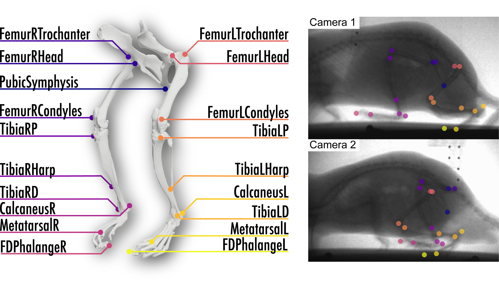

# xray_rat_hindlimb
DeepLabCut models to label rat hindlimb skeletal landmarks in bi-planar x-ray video
Despite the prevalence of rat models to study human disease and injury, existing methods for quantifying behavior through skeletal movements are problematic due to skin movement inaccuracies associated with optical video analysis; or, require invasive implanted markers or time consuming manual rotoscoping for x-ray video approaches. We examined the use of a machine learning tool, DeepLabCut, to perform automated, markerless tracking in bi-planar x-ray videos of locomoting rats. Models were trained on 590 pairs of video frames to identify 19 unique skeletal landmarks of the pelvic limb. Accuracy, precision, and time savings were assessed. Machine-identified landmarks deviated from manually labeled counterparts by 2.4±0.2 mm (n=1,710 landmarks). DeepLabCut decreased analysis time by over three orders of magnitude (1,627x) compared to manual labeling. Distribution of these models may enable the processing of a large volume of accurate x-ray kinematics locomotion data in a fraction of the time without requiring surgically implanted markers.

This work is described in detail in the publication DeepLabCut Increases Markerless Tracking Efficiency in X-Ray Video Analysis of Rodent Locomotion by Nathan J. Kirkpatrick, Robert J. Butera and Young-Hui Chang published in Journal of Experimental Biology, 2022.

## Data Collection
### Animal models
Biplanar high speed x-ray videos (Fig 1A, 45 kV, 100 mA, 100 fps; Imaging Systems & Service, Inc, Painesville, OH) were recorded from a total of 6 adult male Lewis rats (Rattus norvegicus) performing treadmill locomotion in accordance with protocols approved by the Georgia Institute of Technology’s IACUC. Recordings of a reference object with a known angle moving around the capture volume of our x-ray motion analysis system report a mean error of 0.2 degrees (a measure of accuracy) and a variance of 0.8 degrees (a measure of precision). Treadmill position within the capture volume varied between recording sessions, but the direction of gait for all trials was oriented towards the left of the frame for both cameras.

### Training data generation
19 hindlimb skeletal landmarks were manually identified in 590 pairs of x-ray video frames taken from 15 videos across the 6 animals (Fig 2A, B). Training data videos were recorded on 8 different days. Due to naturally occurring differences in treadmill position on each day, collections on different days in this context indicate that there were non-trivial changes in camera perspective from one day to the next. Skeletal landmarks were identified in video pairs within XMALab (Knörlein et al., 2016) to minimize reprojection error between the two views. 

The 19 skeletal landmarks were chosen for their visual clarity. The pelvis is tracked with the pubic symphysis. Proximal limb landmarks included the femoral head, greater trochanter, and lateral epicondyle. For the lower limb segment, the lateral condyle of the tibia, distal fusion of the tibia and fibula, and lateral malleolus of the tibia are tracked. Landmarks on the paw are the caudalmost point of the calcaneus bone, distal end of the first metatarsus and distal end of the first phalanx.

### Model training
For body part tracking we used DeepLabCut (version 2.2.0.3) (Mathis et al., 2018, Nath et al., 2019). Labeled videos from each of the two x-ray cameras, as described above, were trained on separate networks. Then the DeepLabCut default set of 95% of these frames was used for training. We used a ResNet50-based neural network with default parameters for 314,000 training iterations for each camera model in Google Colab (Mountain View, CA) using our custom fork of XROMMTools (Laurence-Chasen et al., 2020) to convert XMALAB data into a DeepLabCut-readable format. 
We tested our models for consistency by training new models on three separate occasions using a randomized shuffle to generate the 95% training set. For each camera model, we found the test error averaged 5.48±0.70 pixels, and average train error was 2.94±0.11 pixels for the camera 1 network. For the camera 2 network, the test error was 5.56±0.52 pixels and the train error was 3.21±0.25 pixels. Both cameras have image sizes of 1,920 by 900 pixels. We then used the DeepLabCut default p-cutoff of 0.9 to condition the X, Y coordinates for future analysis. This network pair was then used to analyze videos from similar experimental settings. 

## Usage
### Using pre-trained models on your x-ray videos
1. Follow the installation instructions for [DeepLabCut-live](https://github.com/DeepLabCut/DeepLabCut-live)
2. Download and expand the xray_rat_hindlimb models from our GitHub directory
3. Download the xray_rat_hindlimb-XROMMTOOLS.py code from this repository
4. Determine which model is best suited for your video
- With the animal walking towards the left side of the frame, if the animal’s RIGHT hindlimb is to the LEFT SIDE of the left hindlimb, use Cam1’s model
- With the animal walking towards the left side of the frame, if the animal’s RIGHT hindlimb is to the RIGHT SIDE of the left hindlimb, use Cam1’s model
5. Run the analyze_xromm_videos_external_model function, paying attention to the directions for use included at the beginning of the function 
6. Load the 2D coordinate .CSV files into XMALab

### Retraining our models using your additional new labeled frames
Our models should be able to be applied to your x-ray videos of rat locomotion. We believe this based on the generalizability of previous optical-video models that have demonstrated an ability to adapt to new videos after being briefly retrained, such as this horse example (Mathis, et al. 2021). 

Like all ML tools, the quality of the training data is critically important. When manually labeling additional frames, be sure to adhere to the landmark conventions, and use XMALab rather than the DeepLabCut GUI to minimize reprojection error. 

Retrained performance is likely to be high so long as your videos have the animal walking in the same direction (towards the left of the frame), and the appropriate camera’s model is chosen for your views (camera 1 has right hindlimb to the left of the left hindlimb, and camera 2 has the right hindlimb to the right of the left hindlimb).

To retrain the models, [you can find the full project files for both models here](https://www.dropbox.com/sh/4k702tprie32h0r/AADukGTcMwFLVPUM55-ge3A3a?dl=0)

These projects can be retrained using the code provided in [XROMM_DLCTools](https://github.com/jdlaurence/XROMM_DLCTools)

## Citations
Kane, Gary A., et al. “Real-Time, Low-Latency Closed-Loop Feedback Using Markerless Posture Tracking.” ELife, vol. 9, Dec. 2020, p. e61909. [Link to paper](https://doi.org/10.7554/eLife.61909)

Knorlein, B. J., Baier, D. B., Gatesy, S. M., Laurence-Chasen, J. D. and Brainerd, E. L. (2016). Validation of XMALab software for marker-based XROMM. The Journal of Experimental Biology, jeb.145383. [Link to paper](https://journals.biologists.com/jeb/article/219/23/3701/16639/Validation-of-XMALab-software-for-marker-based)

Mathis, Alexander, et al. "Pretraining boosts out-of-domain robustness for pose estimation." Proceedings of the IEEE/CVF Winter Conference on Applications of Computer Vision. 2021. [Link to paper](https://openaccess.thecvf.com/content/WACV2021/html/Mathis_Pretraining_Boosts_Out-of-Domain_Robustness_for_Pose_Estimation_WACV_2021_paper.html)
